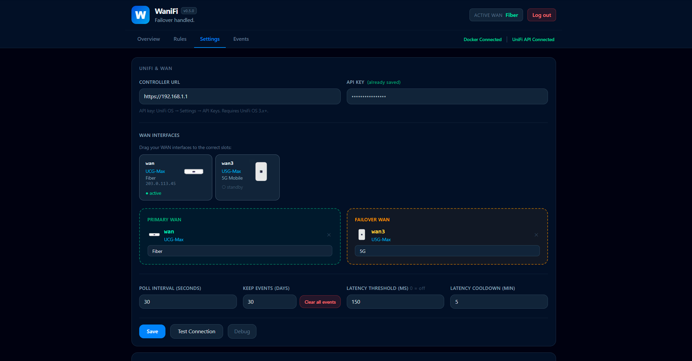
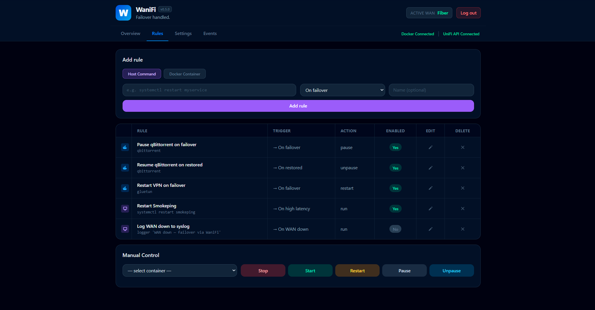
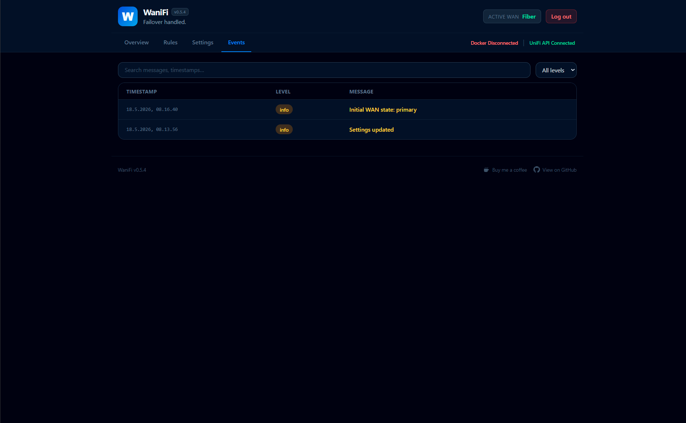

# WaniFi

[](https://buymeacoffee.com/thehef)

Self-hosted dashboard for UniFi WAN failover monitoring with rule-based automation.

When your UniFi gateway switches to a failover WAN, WaniFi can automatically
stop/start Docker containers or run host commands. Handy for things like
pausing qBittorrent on 5G failover so you don't burn through mobile data.

> **Heads up: this is a beta hobby project.**
>
> I'm not a developer or engineer by trade, just a UniFi user who needed
> something like this and couldn't find it. So I built it for myself and
> figured I'd share it in case anyone else is in the same boat. Expect rough
> edges, missing features, and code that an actual engineer would probably
> rewrite.
>
> Not affiliated with Ubiquiti in any way. Just a UniFi user (and fan).


## Features

- 📡 Polls a UniFi controller (UDM / UCG / UX) via the official API key
- 🔁 Rule triggers: `failover`, `restored`, `down`, `high_latency`
- 📈 Live throughput / latency graphs with 1h to 30d ranges
- 🔐 Single-user login (bcrypt; first-run setup wizard)
- 💾 SQLite, no other services required

## Integrations

All integrations are opt-in and can be toggled on/off individually in Settings → Tools.

| Integration | What it does |
|---|---|
| **Host Command** | Runs arbitrary shell commands on the Docker host via `nsenter` (requires `privileged: true` + `pid: host`) |
| **Docker** | Starts, stops, pauses and unpauses containers via the mounted Docker socket |
| **qBittorrent** | Pauses and resumes all torrents via the qBittorrent WebUI API |
| **Emby** | Pauses active Emby streams and unpauses them when the connection is restored |
| **ntfy** | Sends push notifications on failover, restore, high latency, and watcher errors |

## Quick start

Create a folder for WaniFi, drop in a `compose.yaml`, and start it:

```bash
mkdir wanifi && cd wanifi
mkdir -p data
curl -O https://raw.githubusercontent.com/TheHef/WaniFI/main/compose.yaml
docker compose up -d
```

That's it. Docker pulls the pre-built image from GitHub Container Registry
(`ghcr.io/thehef/wanifi`) and starts it on port `8765`. Open
`http://<docker-host>:8765` in a browser.

### compose.yaml

If you'd rather paste it yourself:

```yaml
services:
  wanifi:
    image: ghcr.io/thehef/wanifi:latest
    container_name: wanifi
    restart: unless-stopped
    ports:
      - "8765:8000"
    environment:
      TZ: "Europe/Copenhagen"
    privileged: true
    pid: host
    volumes:
      - ./data:/data
      - /var/run/docker.sock:/var/run/docker.sock
```

> `privileged: true` and `pid: host` are required so WaniFi can run host
> commands via `nsenter`. If you don't need host commands you can drop them
> both and stick to Docker container rules.

To update later: `docker compose pull && docker compose up -d`.

## Setup

### 1. Pick an admin password

On first visit you'll be redirected to `/setup` to choose an admin password.
The bcrypt hash is stored in the local SQLite database, no env vars needed.

### 2. Configure your UniFi controller

In the WaniFi UI go to **Settings**:

- **Controller URL:** `https://<your-UCG-or-UDM-IP>`
- **API Key:** generate one in UniFi OS → Settings → Control Plane →
  Integrations → API Keys (requires UniFi OS 3.x+)
- Click **Test Connection** and your WAN interfaces appear as draggable chips
- Drop one chip into **Primary WAN** and another into **Failover WAN**
- Give them friendly names and hit **Save**



### 3. Enable integrations

Go to **Settings → Tools** and toggle on the integrations you want to use. Each integration exposes its own config section (URL, credentials) once enabled.

### 4. Add rules

Rules tie a WAN event to an action. Examples:

- **Docker** · *On failover* · Pause `qbittorrent`
- **Docker** · *On restored* · Unpause `qbittorrent`
- **qBittorrent** · *On failover* · Pause all torrents
- **Emby** · *On failover* · Pause streams
- **Host Command** · *On high latency* · `systemctl restart smokeping`
- **ntfy** · sends a push notification automatically on any trigger



## Events

Every state change, rule firing, error and manual action is logged. Filter
by level or search the message column; deletion is per-row or all-at-once.



## Building from source

If you'd rather hack on the code instead of using the published image:

```bash
git clone https://github.com/TheHef/WaniFI.git
cd WaniFI
docker build -t wanifi:local .
```

Then point the `image:` field in your `compose.yaml` at `wanifi:local` and
run `docker compose up -d`.

## Security notes

> ⚠️ **LAN only. Do not expose this to the public internet.**
>
> WaniFi needs root-equivalent access to your Docker host to function
> (`privileged: true`, `pid: host`, mounted Docker socket). It is built to
> live behind your firewall on a trusted LAN and nothing else. There is no
> rate limiting, no MFA, no audit logging, and the host-command feature lets
> the admin run arbitrary shell as root. If you absolutely must reach it
> from outside, use a VPN (WireGuard, Tailscale). Do **not** port-forward
> `8765`, and do **not** stick it directly behind a reverse proxy without
> additional authentication. You have been warned.

WaniFi is designed to run **inside your network**, full stop. The threat
model assumes only trusted users can reach the UI.

- **Root on the host.** The container runs with `privileged: true`,
  `pid: host`, and a mounted Docker socket so it can use `nsenter` for
  host-command rules and the Docker API for container actions. Anyone with
  admin access to the WaniFi UI effectively has root on your Docker host.
- **Single-user auth, no MFA, no rate limiting.** The login is one bcrypt
  password and nothing else. Brute-force protection, IP allowlisting, audit
  logging — none of that is in here.
- **Arbitrary shell execution by design.** The "Host Command" rule type
  runs whatever string you type, as root, on the host. That is the feature.
  It is also why this should never be reachable from the public internet.
- **Do not port-forward 8765.** Do not place it behind a reverse proxy
  exposed to the internet, even with HTTPS. If you need remote access, use
  a VPN (WireGuard, Tailscale, etc.) so the WaniFi UI stays on a private
  network where it belongs.
- **Backup `data/wanifi.db`.** It contains your UniFi API key, ntfy token,
  and the bcrypt password hash. It is the only secret store.

## Support

If WaniFi saved you some 5G data or just made your homelab a little nicer,
you can [buy me a coffee](https://buymeacoffee.com/thehef). Completely
optional, deeply appreciated.

## License

MIT. See [LICENSE](LICENSE).

## Trademarks and third-party assets

UniFi product names and the device images in `app/static/devices/` are
trademarks and copyrighted material of Ubiquiti Inc. They are included
here only to identify the hardware your controller reports, with no
implied endorsement or affiliation.

**The MIT license on the rest of this repository does not apply to those
images.** They are used under a nominative-use rationale, not granted
onward. If you fork or redistribute WaniFi and want to play it safe,
replace them with your own icons or remove them entirely.
