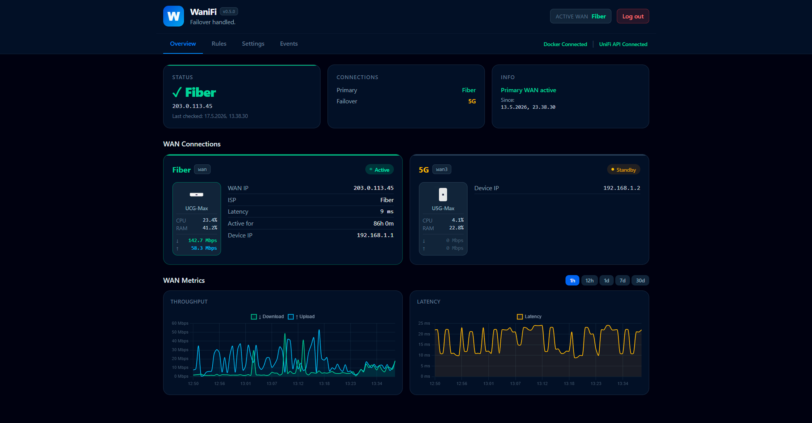

<div align="center">
  
  <h1>WaniFi</h1>
  <p><strong>Failover handled.</strong></p>
  <a href="https://buymeacoffee.com/thehef">
    
  </a>
  &nbsp;
  
  &nbsp;
  
</div>

---

Self-hosted dashboard for UniFi WAN failover monitoring with rule-based automation.

When your UniFi gateway switches to a failover WAN, WaniFi can automatically throttle downloads, cap streaming bitrate, disable DNS filtering, trigger home automations, run shell commands, protect infrastructure with Cloudflare Under Attack mode, and much more — all without any manual intervention.

> **Heads up: this is a beta hobby project.**
>
> I'm not a developer or engineer by trade, just a UniFi user who needed
> something like this and couldn't find it. So I built it for myself and
> figured I'd share it in case anyone else is in the same boat. Expect rough
> edges, missing features, and code that an actual engineer would probably rewrite.
>
> Not affiliated with Ubiquiti or UniFi in any way. Just a UniFi user (and fan).



---

## Features

- **Live dashboard** — active WAN, IP, latency, uptime, CPU/RAM, per-WAN device cards with model icons
- **WAN metrics graphs** — throughput and latency history with 1h / 3h / 6h / 12h / 1d / 7d / 30d ranges
- **Rule engine** — pair any trigger with any action; rules fire automatically on WAN state changes
- **Speedtest** — run on demand or trigger automatically on failover; results stored and displayed in the dashboard
- **Push notifications** — per-channel event toggles for failover, restored, high latency, and errors
- **Backup / restore** — full JSON export and import of all settings, rules, and events
- **Single-user login** — bcrypt password, rate-limited login (10 attempts / 5 min / IP)
- **Self-contained** — SQLite only, all JS/CSS bundled, no CDN calls

---

## Integrations

All integrations are opt-in and toggled on/off individually in **Settings**.

### ⚙️ APIs

These three are top-level toggles and appear outside any category group.

| Integration | Actions |
|---|---|
| **Docker** | Stop · start · restart · pause · unpause containers via the Docker socket |
| **Host Command** | Run arbitrary shell commands on the Docker host via `nsenter` |
| **Webhook** | Send HTTP GET or POST to any URL |

### 📥 Downloads

| Integration | Actions |
|---|---|
| **qBittorrent** | Pause/resume all · enable/disable alt speed · set download/upload limit |
| **SABnzbd** | Pause · resume · set speed limit |
| **NZBGet** | Pause · resume · set speed limit |
| **Transmission** | Pause/resume all · enable/disable alt speed · set download/upload limit |
| **Deluge** | Pause/resume all · set download/upload limit |
| **Sonarr** | Disable/enable indexers · disable/enable download clients · search missing · refresh all |
| **Radarr** | Disable/enable indexers · disable/enable download clients · search missing · refresh all |

### 🎬 Media

| Integration | Actions |
|---|---|
| **Emby** | Set/clear remote bitrate limit · restream active sessions · stop all sessions |
| **Jellyfin** | Set/clear remote bitrate limit · restream active sessions · stop all sessions |
| **Plex** | Set/clear remote bitrate limit · stop all streams |

### 🏠 Homelab

| Integration | Actions |
|---|---|
| **Home Assistant** | Call webhook · turn on/off entity |
| **Proxmox** | Start · stop · shutdown · suspend · resume VM or LXC |
| **Portainer** | Start · stop · restart container |
| **TrueNAS** | Start · stop · restart service |
| **Unraid** | Start · stop · pause · resume VM |
| **Node-RED** | Trigger any HTTP-in flow endpoint |
| **Nginx Proxy Manager** | Enable/disable any proxy host by domain name or numeric ID |
| **Cloudflare** | Enable/disable Under Attack mode · purge cache · enable/disable development mode |
| **NUT / UPS** | Get status · beeper enable/disable · shutdown.return · shutdown.stayoff · load.off |

### 🌐 Network

| Integration | Actions |
|---|---|
| **UniFi** | Kick all clients · disable/enable WLAN · block/unblock client by MAC *(always on)* |
| **Speedtest** | Run a speedtest and log the result *(always on)* |
| **Pi-hole** | Enable/disable DNS filtering (v5 and v6 API) |
| **AdGuard Home** | Enable/disable DNS filtering |

### 🔔 Notifications

Each channel independently opts in/out of each event type via per-channel toggles.

| Channel | Notes |
|---|---|
| **ntfy** | Self-hosted or ntfy.sh · optional Bearer token |
| **Discord** | Webhook URL |
| **Telegram** | Bot token + chat ID |
| **Pushover** | App token + user key |
| **Gotify** | Self-hosted · API token |

Failover and restored notifications include live metrics: active WAN name, IP, latency, and current throughput.

---

## Quick start

```bash
mkdir wanifi && cd wanifi
mkdir -p data
curl -O https://raw.githubusercontent.com/TheHef/WaniFI/main/compose.yaml
docker compose up -d
```

Open `http://<docker-host>:4444` in a browser.

### compose.yaml

```yaml
services:
  wanifi:
    image: ghcr.io/thehef/wanifi:latest
    container_name: wanifi
    restart: unless-stopped
    ports:
      - "4444:8000"
    environment:
      TZ: "Europe/Copenhagen"
      PORT: "8000"
    privileged: true
    pid: host
    extra_hosts:
      - "host.docker.internal:host-gateway"
    volumes:
      - ./data:/data
      - /var/run/docker.sock:/var/run/docker.sock
```

> `privileged: true` and `pid: host` are only required for **Host Command** rules (so WaniFi can run commands via `nsenter`). If you don't use host commands, you can safely drop both and keep just the Docker socket mount.

To update: `docker compose pull && docker compose up -d`

---

## Setup

### 1. Admin password

On first visit you'll be redirected to `/setup` to choose an admin password. The bcrypt hash is stored in the local SQLite database — no env vars needed.

### 2. UniFi controller

Go to **Settings → Network**:

- **Controller URL** — `https://<your-UCG-or-UDM-IP>`
- **API Key** — generate one in UniFi OS → Settings → Control Plane → Integrations → API Keys (requires UniFi OS 3.x+)
- Click **Test Connection** — your WAN interfaces appear as chips
- Assign one to **Primary WAN** and one to **Failover WAN**, give them friendly names, and hit **Save**

### 3. Enable integrations

Go to **Settings** and toggle on the integrations you need. Each one reveals its own config section when enabled. Use **Test** to verify connectivity before saving.

### 4. Add rules

Go to the **Rules** tab. Each rule pairs a **trigger** with an **action**:

| Trigger | Fires when… |
|---|---|
| `On failover` | Gateway switches to the failover WAN |
| `On restored` | Gateway switches back to the primary WAN |
| `On WAN down` | No WAN connectivity detected |
| `On high latency` | Latency exceeds the configured threshold |

Rules can have an optional **delay** (seconds) before firing, and can be enabled/disabled and reordered individually. They can also be **run manually** from the Rules tab at any time.

**Example — 5G failover scenario:**

| Rule | Trigger | Action |
|---|---|---|
| Slow qBittorrent | On failover | qBittorrent: enable alt speed |
| Normal qBittorrent | On restored | qBittorrent: disable alt speed |
| Limit Plex streams | On failover | Plex: set remote bitrate 4 Mbps |
| Unlimit Plex streams | On restored | Plex: clear remote bitrate |
| Protect with Cloudflare | On failover | Cloudflare: enable Under Attack mode |
| Disable Under Attack | On restored | Cloudflare: disable Under Attack mode |
| Disable DNS filter | On failover | Pi-hole: disable |
| Enable DNS filter | On restored | Pi-hole: enable |

### 5. Notifications (optional)

In **Settings → Notifications** enable one or more channels. Each channel has individual event toggles so you can, for example, only get Discord alerts for failover/restored and skip high latency noise.

### 6. Backup

Use **Settings → Backup** to export a full JSON snapshot of all settings, rules, and events at any time. The same page lets you restore from a previous export.

---

## Events

Every state change, rule firing, error, and manual action is logged with a timestamp and severity level. Filter by level or search by message; rows can be deleted individually or cleared all at once.

---

## Building from source

```bash
git clone https://github.com/TheHef/WaniFI.git
cd WaniFI
docker build -t wanifi:local .
```

Then point the `image:` field in your `compose.yaml` at `wanifi:local` and run `docker compose up -d`.

---

## Security notes

> ⚠️ **LAN only — do not expose to the public internet.**

WaniFi runs with `privileged: true`, `pid: host`, and a mounted Docker socket. Anyone who can reach the UI can effectively run arbitrary commands as root on your Docker host. That is intentional — it is what makes the automation work — but the attack surface is real.

- **Keep it on your LAN.** Use a VPN (WireGuard, Tailscale) if you need remote access.
- **No MFA.** If that isn't enough for your threat model, put an auth proxy in front (e.g. Authelia).
- **Backup `data/wanifi.db`.** This file holds your UniFi API key, all integration credentials, and the password hash.
- **No external requests at runtime.** Alpine.js, Chart.js, and Tailwind CSS are all bundled inside the container — no CDN calls, no third-party scripts.
- **Security headers.** Every response includes `X-Frame-Options: DENY`, `X-Content-Type-Options: nosniff`, and `Referrer-Policy: strict-origin-when-cross-origin`.

---

## Support

If WaniFi saved you some 5G data or just made your homelab a little nicer, you can [buy me a coffee ☕](https://buymeacoffee.com/thehef). Completely optional, deeply appreciated.

---

## License

MIT. See [LICENSE](LICENSE).

## Trademarks and third-party assets

UniFi product names and the device images in `app/static/devices/` are trademarks and copyrighted material of Ubiquiti Inc. They are included here only to identify the hardware your controller reports, with no implied endorsement or affiliation.

**The MIT license on this repository does not apply to those images.** They are used under a nominative-use rationale, not granted onward. If you fork or redistribute WaniFi and want to play it safe, replace them with your own icons or remove them entirely.
